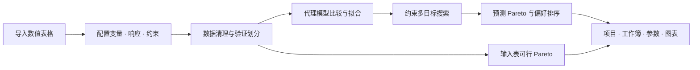

<div align="center">


# 研究多目标优化器

**从工程数据到可追溯的优化方案**<br>
可配置问题定义 · 代理模型验证 · 约束优化 · 决策与图表导出


[快速开始](#快速开始) · [功能](#功能) · [界面展示](#界面展示) · [示例](#示例项目) · [使用指南](docs/user-guide.zh-CN.md) · [English](README_EN.md)

</div>

将 Excel、CSV 等数值表格中的设计变量与响应指标，转化为可检验、可比较、可导出的优化结果。通过桌面界面配置变量、目标方向、工程约束和验证策略，无需为每个研究对象修改源码。

适合以试验或仿真样本开展代理模型研究的工程场景。内置电池液冷、换热器、结构设计模板，并保留 MTPV/MTEG 氢气微燃烧器的物理耦合工作流。


<p align="center"><sub>真实软件运行截图 · 电池液冷合成函数示例 · 左侧配置目标，右侧查看预测与输入表 Pareto、目标平衡和偏好排序。</sub></p>

## 快速开始

需要 **Python 3.10 或更高版本**。当前图形界面已在 Windows 环境实测。

```powershell
git clone https://github.com/Zhuayu16/research-multiobjective-optimizer.git
cd research-multiobjective-optimizer
python -m venv .venv
.\.venv\Scripts\python.exe -m pip install -r requirements.txt
.\.venv\Scripts\python.exe app.py
```

依赖安装完成后，可直接双击 **`run_gui.bat`**。它会优先使用项目 `.venv`，再尝试 Conda base 或系统 Python。也可通过 `RESEARCH_OPTIMIZER_PYTHON` 指定解释器。

**第一次运行：**

1. 选择“电池液冷”“换热器”或“结构设计”，点击 **载入合成示例**。
2. 检查左侧变量、目标、约束和验证设置，点击 **开始优化**。
3. 查看右侧结果，使用 **保存项目** 或 **导出本次结果与图表** 留存本次研究。

已有试验或仿真数据时，点击“导入数据表”，重新指定数据列、单位和目标方向即可。完整操作与计算定义见 [中文使用指南](docs/user-guide.zh-CN.md)。

<details>
<summary><b>安装为软件包 / 在 Python 中调用</b></summary>

在仓库目录内执行：

```powershell
python -m pip install .
research-optimizer
```

不经过界面也可以运行同一套通用计算流程：

```python
from mtpv_optimizer.presets import example
from mtpv_optimizer.general import run_general
from mtpv_optimizer.workflow import export_workbook

problem, data = example("exchanger")
result = run_general(data, problem)
export_workbook(result, "result.xlsx")
```

软件包从本仓库安装，当前没有声明 PyPI 发布。

</details>

## 功能

| 研究环节 | 软件提供的能力 |
| :--- | :--- |
| **定义问题** | 动态添加变量与响应；连续、整数、有限数值集合；各目标独立最小化/最大化；只用于约束的辅助响应 |
| **整理数据** | Excel 多工作表、CSV、TSV、记录列表 JSON；无效行审计；重复测量报错、保留或取均值 |
| **验证模型** | 随机、分组、时间前向交叉验证；独立留出；逐响应选型；预测对照图与误差指标 |
| **约束搜索** | NSGA-II 可行方案优先；算术表达式约束；训练边界框或样本凸包；最近样本覆盖距离限制 |
| **比较方案** | 预测 Pareto 与输入表 Pareto 分开；IDEAL、TOPSIS、ARAS；多次独立运行与权重对比 |
| **保存研究** | `.optproj` 保存原始数据与配置；Excel、参数 JSON、数据校验值；SVG/PDF/TIFF/PNG 图表 |
| **规划下一轮** | 拉丁超立方试验设计；整数与集合变量适配；保留中心重复设计 |
| **保留领域物理** | MTPV/MTEG 专用入口：混合物流量、燃料输入、两级总电功率和能量效率耦合计算 |

内置代理模型包括线性/二次响应面、高斯过程、SVR、MLP、随机森林、ExtraTrees 和梯度提升。通用模式的 Auto 按响应比较交叉验证 NRMSE，选择相应模型。

## 界面展示

下面均为运行软件后直接截取的界面，截图脚本见 [scripts/capture_screenshots.py](scripts/capture_screenshots.py)。前三个领域使用合成函数数据；MTPV/MTEG 截图展示未加载数据的专用入口。真实研究数据不随公开仓库发布。

<details>
<summary><b>工程约束｜设置温度限值与表达式关系</b></summary>


约束可引用变量或建模响应，例如 `Tmax_K <= 315`。关系、限值、容差与归一化尺度分别设置；带空格列名可使用 `col("列名")`。

</details>

<details>
<summary><b>模型验证｜对照预测、检查误差与数据划分</b></summary>


该图来自可被二次响应面表达的合成函数，因此出现接近零的误差；它用于演示验证流程，不代表真实工程数据的预测精度。

</details>

<details>
<summary><b>换热器｜两个目标与有限数值集合变量</b></summary>


热量最大化、压降最小化；间距限制为 `{2, 4, 6}` mm，展示离散变量与约束的组合。

</details>

<details>
<summary><b>结构设计｜四个目标与零值、负值响应</b></summary>


质量、挠度和成本最小化，安全裕量最大化；以安全裕量下限约束可行方案。

</details>

<details>
<summary><b>MTPV/MTEG｜专用物理耦合入口</b></summary>


保留氢气/空气微燃烧器的领域计算，可导入自己的数值表格。真实研究数据未公开，详细公式与响应留出检验边界见 [使用指南](docs/user-guide.zh-CN.md#h2air-两级耦合)。

</details>

## 示例项目

点击界面的“打开项目”，选择下列 `project.optproj` 即可恢复数据与完整设置。

| 示例 | 变量 / 优化目标 | 可下载文件 |
| :--- | :--- | :--- |
| 电池液冷 | 3 个变量 / 3 个最小化目标 | [项目](examples/battery/project.optproj) · [CSV](examples/battery/data.csv) |
| 换热器 | 2 个变量（含数值集合）/ 最大化 + 最小化 | [项目](examples/exchanger/project.optproj) · [CSV](examples/exchanger/data.csv) |
| 结构设计 | 2 个变量 / 4 个混合方向目标 | [项目](examples/structure/project.optproj) · [CSV](examples/structure/data.csv) |
| MTPV/MTEG | 自行提供数据 / 专用物理耦合 | [数据格式与私有数据说明](data/README.md) |

三个通用示例各包含 60 个合成样本，生成种子为 73。它们用于运行演示和软件功能检验，不能作为物理试验或 CFD 验证证据。生成方式、字段与参数见 [示例说明](examples/README.md)。

自己的数据采用“一行一个样本、一列一个变量或响应”的形式。`case`、`batch`、`time` 等标识列可用于追溯、分组或时间验证，输入无需固定为三个目标。

## 工作流与结果追溯



导出绑定**计算开始时的配置快照**。结果附带软件版本、随机种子、模型与搜索设置、验证记录和数据校验值，便于核对同一次计算。`.optproj` 保存数据与配置，打开后可以重新计算。

代码职责与数据流见 [架构说明](docs/architecture.md)。

## 验证与适用边界

**v0.2.0 本地验证：35 项自动测试通过，两套真实 Qt 界面测试通过，安装包在独立目录中的启动与数据加载检查通过。** 安装包检查复用了已有 Anaconda 依赖，尚未完成所有操作系统或全新机器验证。

```powershell
python -m unittest discover -s tests -v
python tests/gui_general_smoke.py
python tests/gui_smoke.py
```

公开版本运行 26 项自动测试；9 项依赖私有研究数据的检查明确跳过。通用界面测试会打开窗口、执行后台优化并检查交互与导出，然后关闭窗口。专用界面测试需要私有数据，否则报告跳过。生成文件位于被忽略的 `outputs/` 目录。

- 当前面向**数值表格**，不直接支持无序类别变量；单位用于标注与记录，不自动换算。
- 通用训练集至少需要 10 个不同设计；连续变量至少 3 个水平，整数/集合变量至少 2 个水平。
- 搜索边界不得超过训练范围；覆盖距离反映样本接近程度，不是预测置信区间。
- Auto 选型与展示的 CV 指标共用验证折，未实现嵌套验证；通用独立留出数据不参与选型、拟合或搜索域建立。
- 模型候选需要进一步试验或仿真确认。软件不自动调用 Fluent 求解，二进制 `.dat.h5` 也不能直接作为表格导入。

## 仓库结构

```text
research-multiobjective-optimizer/
├── app.py                    # MTPV/MTEG 专用界面与兼容入口
├── run_gui.bat               # Windows 启动脚本
├── mtpv_optimizer/           # 问题定义、模型、搜索、通用界面与导出
├── data/                     # 数据格式说明（真实研究数据未公开）
├── examples/                 # 可打开的跨领域示例项目
├── docs/                     # 使用指南、架构说明与真实截图
├── scripts/                  # 截图复现脚本
└── tests/                    # 算法、数据、图表与界面检查
```

## 交流与贡献

欢迎通过 [Issues](https://github.com/Zhuayu16/research-multiobjective-optimizer/issues) 提交可复现的问题、研究场景和改进建议。提交代码前请阅读 [贡献说明](CONTRIBUTING.md)。版本变化见 [CHANGELOG](CHANGELOG.md)。

**许可状态：** 当前仓库尚未指定开源许可证，使用与再分发授权以仓库后续明确的许可为准。
