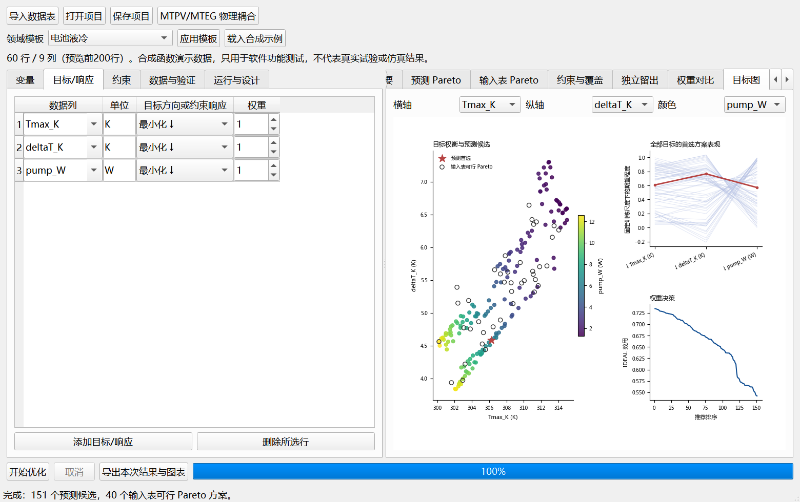
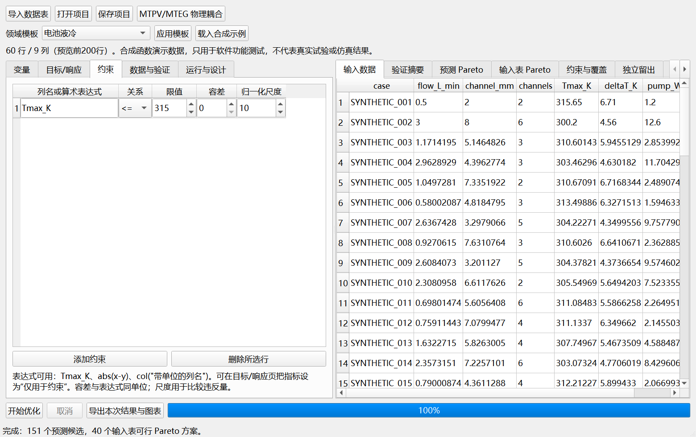
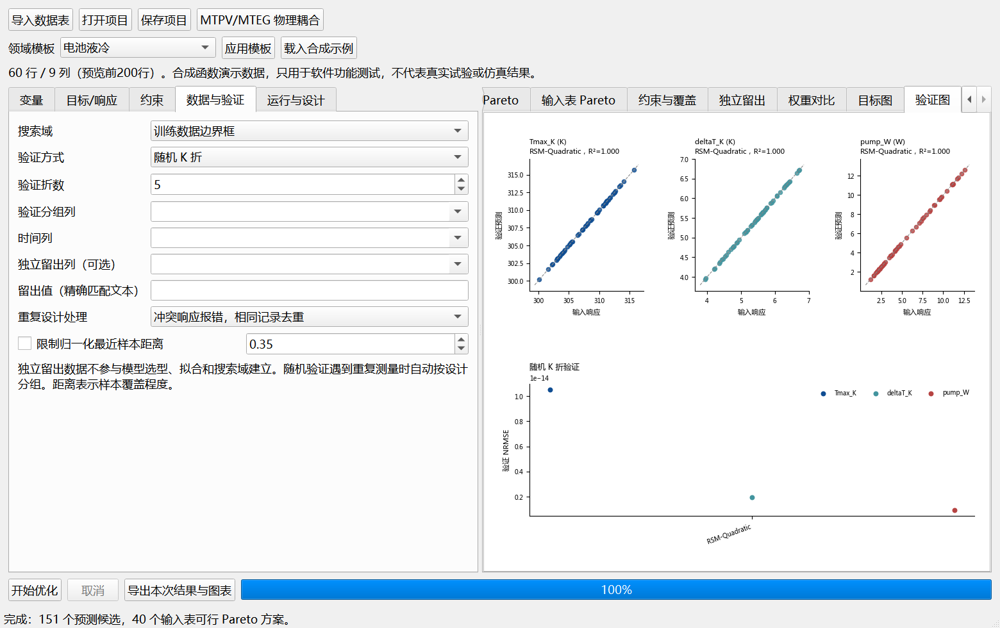
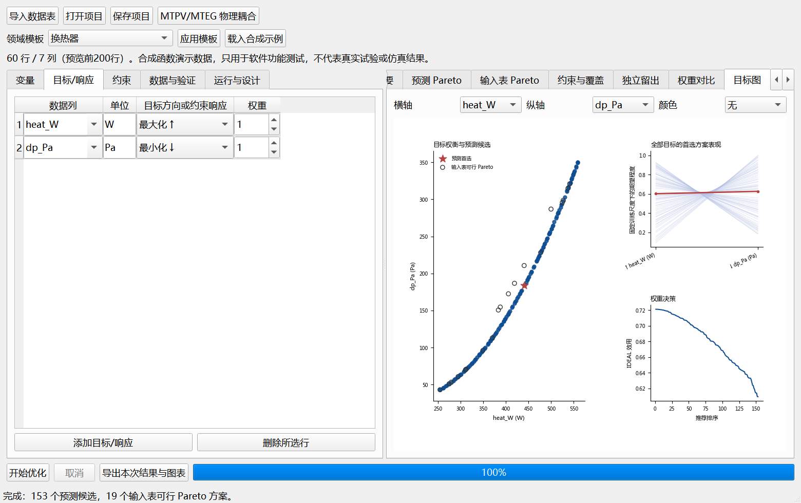
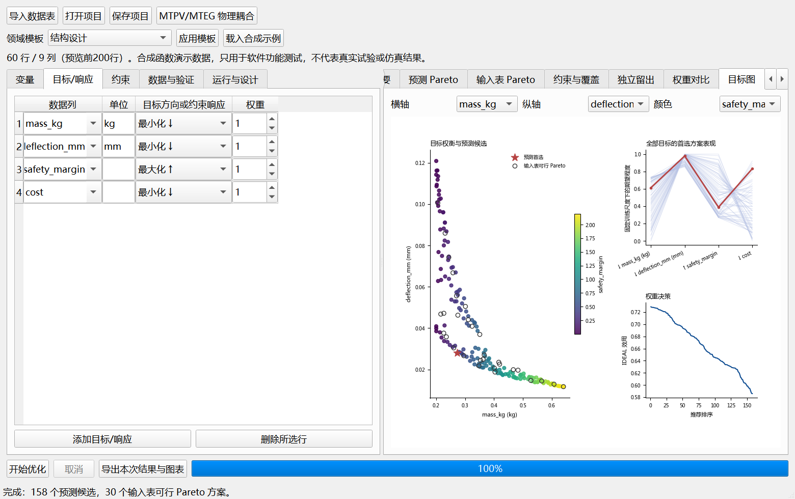
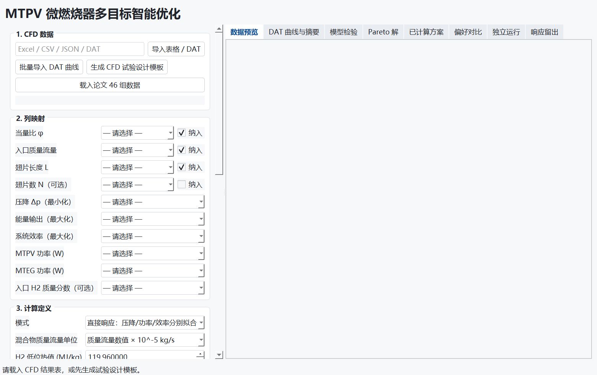

<div align="center">


# Research Multiobjective Optimizer

**From engineering data to traceable design decisions**


[简体中文](README.md) · [Examples](examples/README.md) · [User guide (Chinese)](docs/user-guide.zh-CN.md) · [Architecture](docs/architecture.md)

[Numerical verification and raw data](docs/verification.md) · [Gallery: 18 screenshots and 8 figure groups](docs/gallery.md)

</div>

A desktop research tool for surrogate modelling, constrained multi-objective optimization, and preference-based ranking of numerical experimental or simulation data. Configure variables, objective directions, response constraints, and validation settings in the interface without modifying the source for each domain.

The general workflow includes battery cooling, heat exchanger, and structural design presets. A separate MTPV/MTEG workflow retains hydrogen/air fuel-input and power/efficiency coupling.



*Actual running application. This battery example uses synthetic functions, not experimental or CFD results.*

## Results checked against known answers

The reproducible suite runs **30 optimization trials, 10 equal-budget random baselines, three synthetic engineering workflows, and 13 numerical/workflow checks**. It uses analytical answers and reevaluates returned candidates with the original functions.

| Check | Recorded result |
| :--- | :--- |
| Two-variable ZDT1, ten seeds | Mean HV / reference-front HV **99.18%**; mean reference-to-set distance **0.00600** |
| Interior optimum outside the training grid, full surrogate pipeline | Mean coordinate error **8.36×10⁻⁵** across ten seeds |
| Continuous, integer, finite-set variables and a response constraint | True objective gap **< 3×10⁻⁹** in every seed; all returned candidates feasible |
| Battery, exchanger and structure synthetic examples | **100%** true-function constraint feasibility for **151 / 153 / 158** candidates |


Each ZDT1 method uses 24,080 function evaluations per seed, population 80 and 100 generations for NSGA-II. This is a two-variable kernel check, not a claim about standard 30-dimensional benchmarks. Exact quadratic examples verify implementation consistency, not physical prediction accuracy. See the [methods and scope](docs/verification.md), [per-seed CSV](validation/results/benchmark_runs.csv), [machine-readable checks](validation/results/summary.json), and [reproduction script](scripts/validate_feasibility.py).

## Getting started

Python 3.10+ is required. The graphical application has been tested on Windows.

```powershell
git clone https://github.com/Zhuayu16/research-multiobjective-optimizer.git
cd research-multiobjective-optimizer
python -m venv .venv
.\.venv\Scripts\python.exe -m pip install -r requirements.txt
.\.venv\Scripts\python.exe app.py
```

After installation, double-click `run_gui.bat`. It prefers the project `.venv`, then tries Conda base or system Python. `RESEARCH_OPTIMIZER_PYTHON` can override the interpreter.

Choose a domain and click **载入合成示例** (load synthetic example), review the settings, then **开始优化** (start optimization). Alternatively, open an [example project](examples/README.md) with **打开项目** (open project). The current interface is in Chinese.

To install the package from this checkout:

```powershell
python -m pip install .
research-optimizer
```

There is no claimed PyPI release. The computation can also be called from Python:

```python
from mtpv_optimizer.presets import example
from mtpv_optimizer.general import run_general
from mtpv_optimizer.workflow import export_workbook

problem, data = example("exchanger")
result = run_general(data, problem)
export_workbook(result, "result.xlsx")
```

## Capabilities

| Stage | Supported features |
| :--- | :--- |
| Problem definition | Continuous, integer, and finite numeric-set variables; per-objective min/max; auxiliary responses used only in constraints |
| Data preparation | Excel sheets, CSV, TSV, record-list JSON; invalid-row audit; configurable replicate handling |
| Model assessment | Random, grouped, or forward time validation; independent holdout; per-response model comparison; prediction and error plots |
| Search | Feasibility-first NSGA-II; arithmetic constraints; training box or convex hull; optional nearest-sample coverage limit |
| Decision support | Separate predicted and input-data Pareto sets; IDEAL, TOPSIS, ARAS; multiple runs and preference comparisons |
| Reproducibility | Data and configuration in `.optproj`; Excel results, parameter JSON, data checksum, and SVG/PDF/TIFF/PNG figures |
| Experiment planning | Latin hypercube design with integer/set handling and retained center replicates |

Surrogate families include linear/quadratic response surfaces, Gaussian processes, SVR, MLP, random forests, ExtraTrees, and gradient boosting. General-mode Auto selects each response model by cross-validation NRMSE.

## Examples and screenshots

Each general example provides 60 synthetic samples (data seed 73), a CSV file, and a project that can be opened directly. See [example files and definitions](examples/README.md). The private 46-case MTPV/MTEG dataset is not distributed; see [input format and private-data notes](data/README.md).

<details>
<summary><b>Constraints and validation</b></summary>





The battery functions can be represented by a quadratic model; the near-zero errors shown here demonstrate the workflow and do not establish real engineering accuracy.

</details>

<details>
<summary><b>Two- and four-objective examples</b></summary>





</details>

<details>
<summary><b>Dedicated MTPV/MTEG workflow</b></summary>



This screenshot shows the dedicated interface before loading data. Import your own table to run this workflow. See the [Chinese guide](docs/user-guide.zh-CN.md) for physics definitions and the scope of its response-holdout check.

</details>

The [full gallery](docs/gallery.md) contains **18 actual application screenshots and 8 numerical figure groups**, including model comparison, independent holdout, auxiliary responses and reopening a saved project. Capture scripts: [basic views](scripts/capture_screenshots.py) and [workflow views](scripts/capture_workflow.py).

## Verification and limitations

The public checkout passes **30 regression tests** and explicitly skips nine checks requiring private data. The separate reproducible feasibility suite passes **13 checks**; actual Qt workflow capture verifies calculation, holdout evaluation, model comparison and project restoration. Its installed-package startup check opens both interfaces without bundling research data and reuses the current interpreter's dependencies. A [Windows CI workflow](https://github.com/Zhuayu16/research-multiobjective-optimizer/actions/workflows/verification.yml) provides hosted-runner checks; consult its actual run status. Cross-platform and physical validation remain pending.

```powershell
python -m unittest discover -s tests -v
python tests/gui_general_smoke.py
python tests/gui_smoke.py
python scripts/validate_feasibility.py
python scripts/capture_workflow.py
```

- Inputs are numerical tables; unordered categorical variables are not supported. Units are annotations and are not converted automatically.
- General training requires at least ten distinct designs and sufficient variable levels. Bounds cannot exceed the training ranges.
- Nearest-sample distance describes coverage, not a predictive confidence interval.
- Auto selection and reported CV metrics share folds; nested validation is not implemented. General-mode holdout data are excluded from selection, fitting, and search-domain construction.
- Predicted candidates require experimental or simulation confirmation. The software does not launch Fluent solves or import binary `.dat.h5` files as tables.
- Project files store data and settings for rerunning, rather than serialized executable models.

## Contributing and licensing

Report reproducible issues or domain use cases through [Issues](https://github.com/Zhuayu16/research-multiobjective-optimizer/issues). See [contribution instructions](CONTRIBUTING.md) and [version history](CHANGELOG.md).

No open-source license has been specified for this repository. Use and redistribution permissions are subject to an explicit license from the repository owner.
