# 软件界面与验证图集

[返回首页](../README.md) · [验证方法、指标与数据](verification.md)

**18 张真实软件截图 + 8 组数值验证图。** 界面截图直接由运行中的 Qt 窗口抓取；公开案例全部来自合成或解析函数。截图复现：[基础视图](../scripts/capture_screenshots.py) · [计算与验证流程](../scripts/capture_workflow.py)。

## 定义问题与启动计算

变量类型、边界及数值集合；通用研究界面中的目标权衡；工程约束；模型和搜索设置。

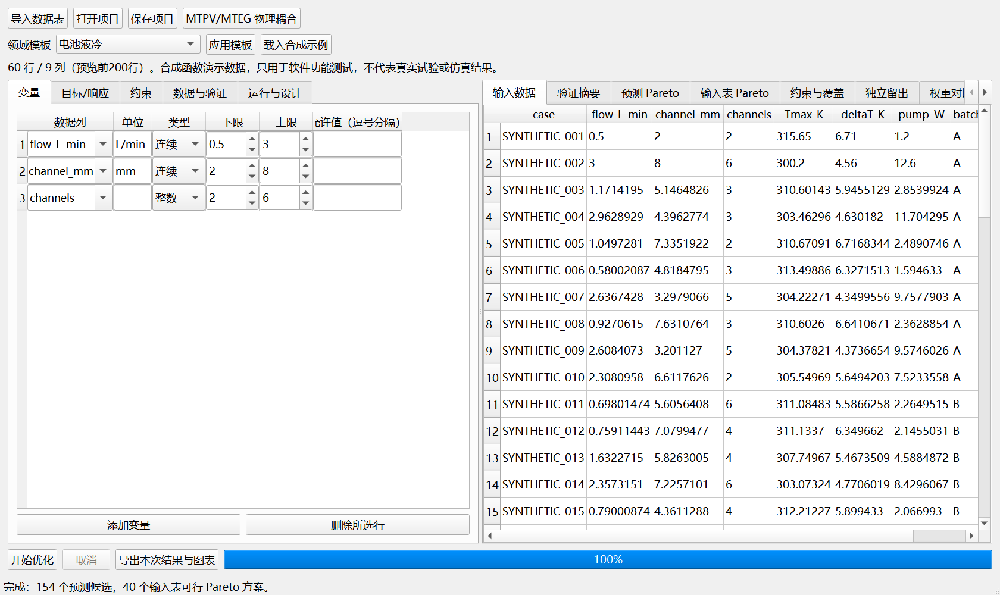

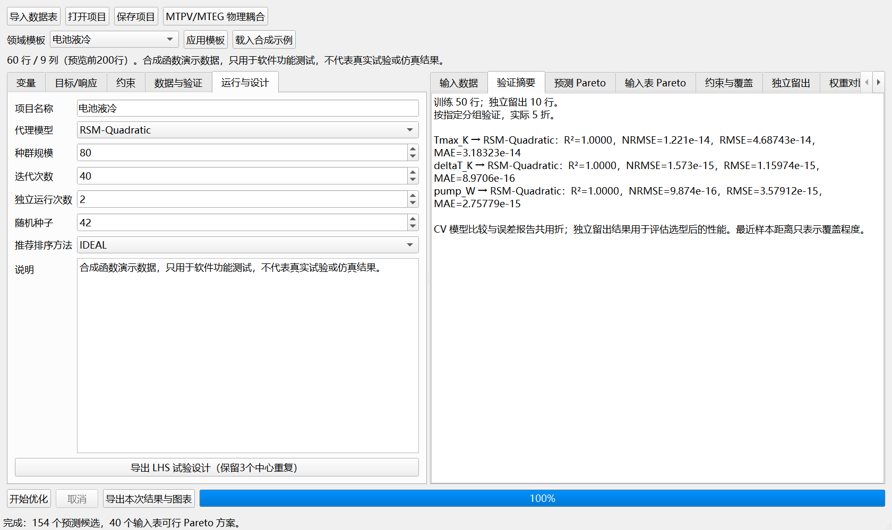

## 模型比较与独立留出

Auto 实际比较多个模型族；计算汇总记录种子与数据；电池示例按批次保留 10 个独立测试样本、50 个训练样本。二次合成函数的近零误差仅说明模型与函数相容。

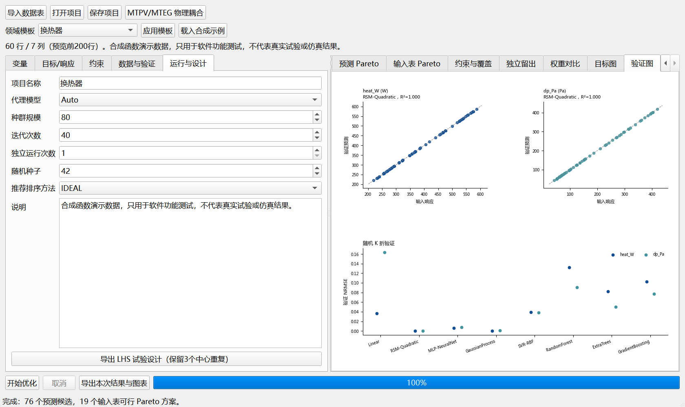

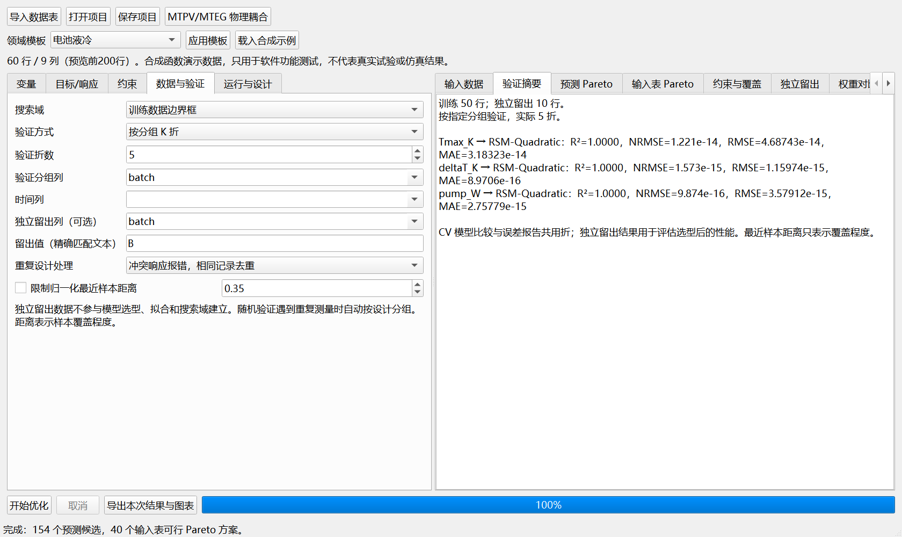

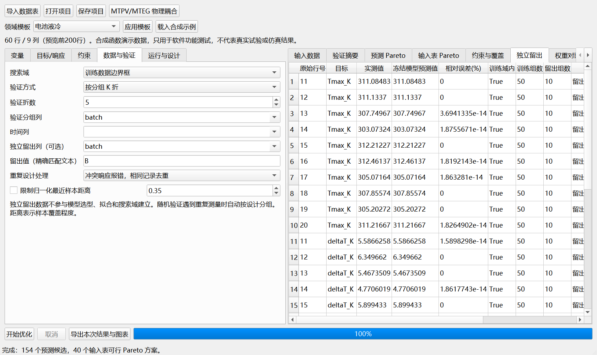

## 检查候选与辅助约束

预测候选与输入样本中的 Pareto 点分别展示。覆盖距离用于检查候选与已有数据的接近程度；它不等于置信区间。辅助响应案例训练三个响应，只优化两个目标，并将温差用于约束。

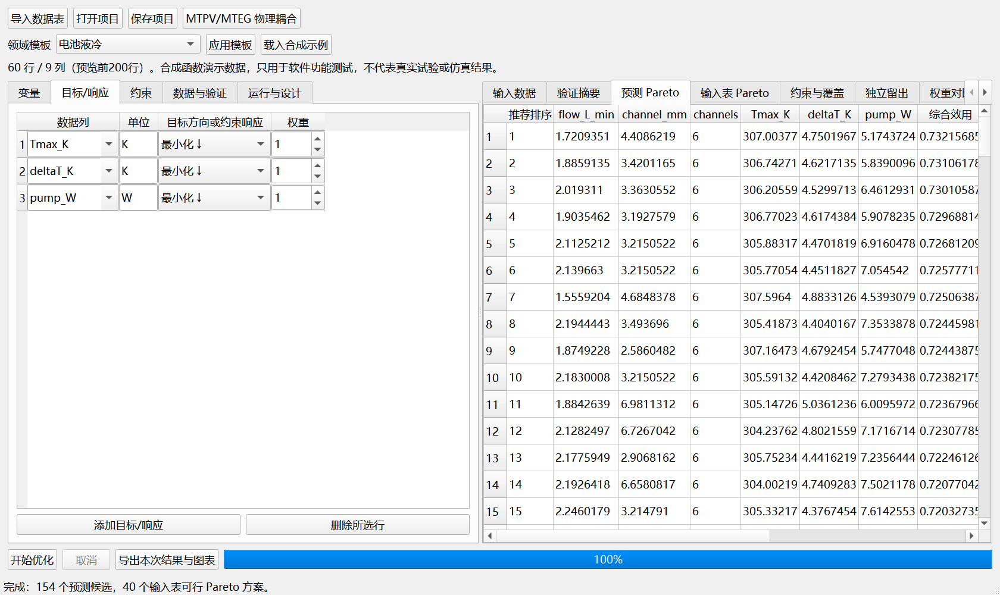

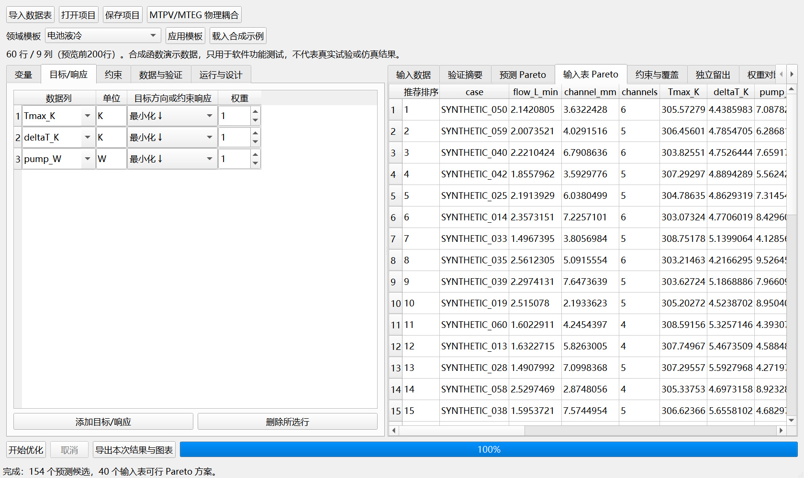

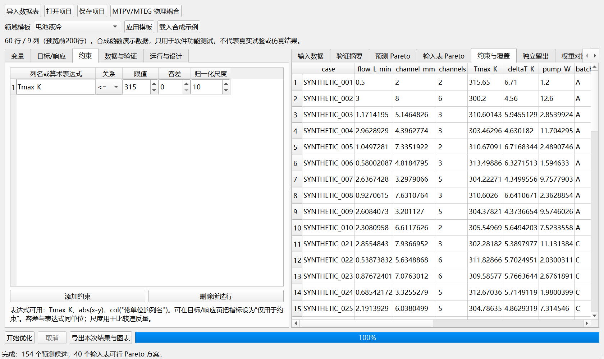

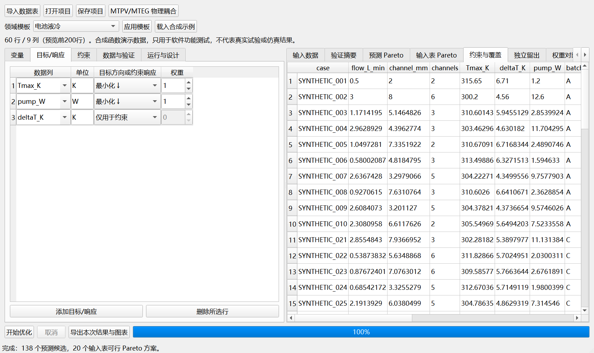

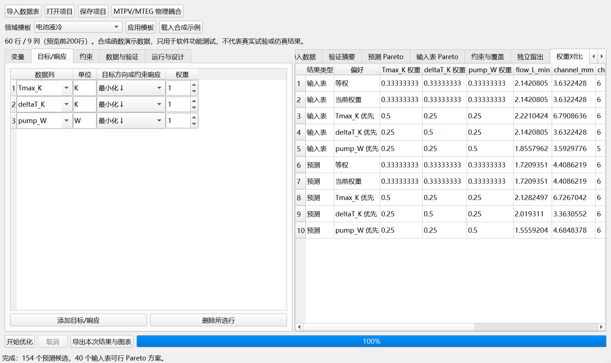

## 更换对象、恢复项目与解析答案

换热器使用两个混合方向目标和数值集合变量；结构设计使用四个目标。项目恢复图来自重开保存项目后的实际重新计算；解析最优解截图来自验证脚本生成的数据。专用 MTPV/MTEG 截图为尚未加载研究数据的界面。

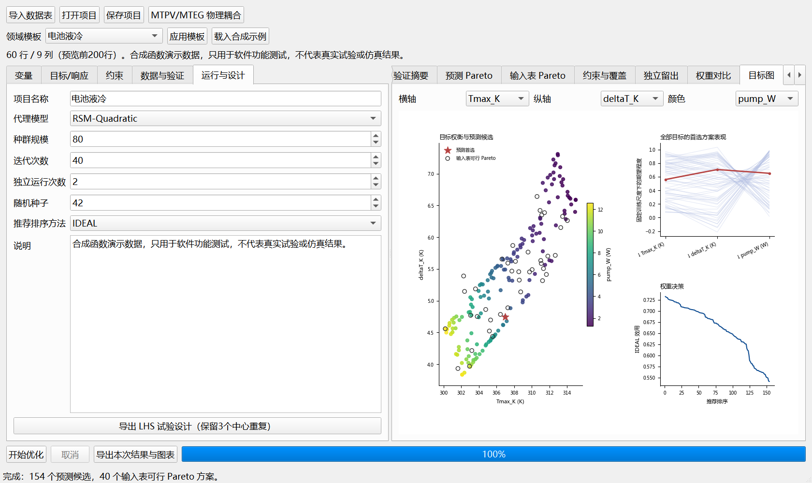

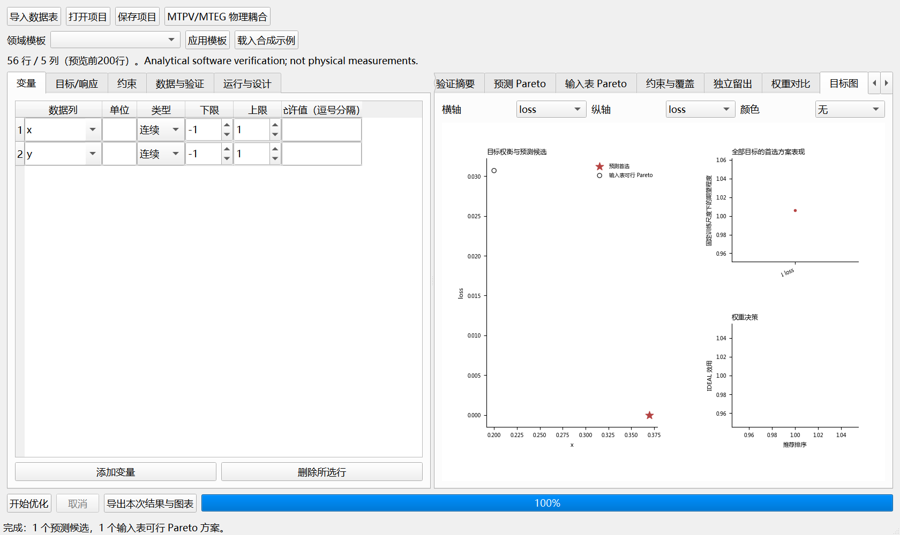

## 数值结果与已知答案对照

方法、种子、阈值与适用范围见 [验证报告](verification.md)，原始表格见 [结果目录](../validation/results/)。图中使用合成函数真值，不代表实测或 CFD 验证。

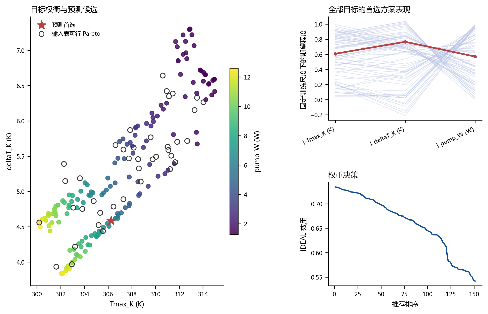

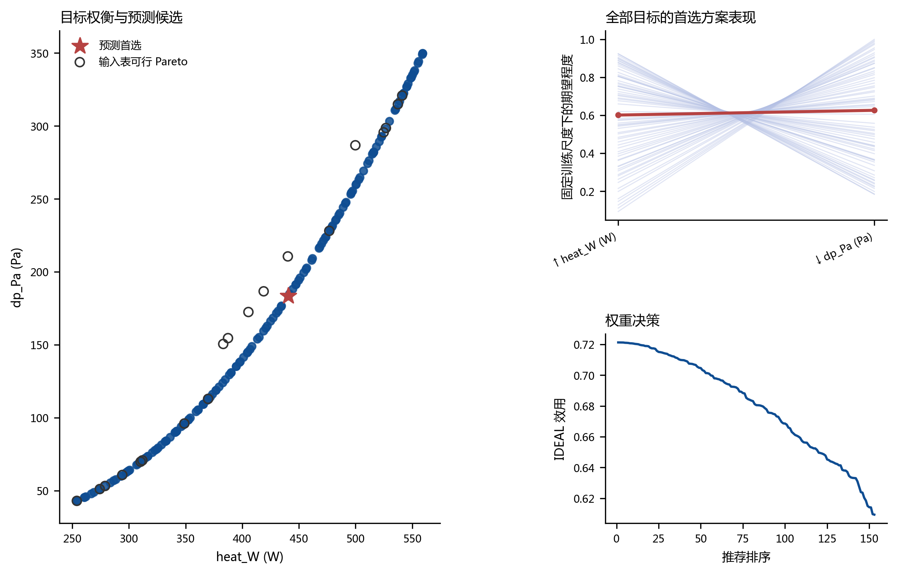

### 可编辑及矢量文件

| 图 | SVG | PDF |
| :--- | :--- | :--- |
| ZDT1 前沿与基线 | [SVG](assets/verification/zdt1_benchmark.svg) | [PDF](assets/verification/zdt1_benchmark.pdf) |
| 解析最优解误差 | [SVG](assets/verification/known_optima.svg) | [PDF](assets/verification/known_optima.pdf) |
| 独立留出 | [SVG](assets/verification/independent_holdout.svg) | [PDF](assets/verification/independent_holdout.pdf) |
| 跨领域原函数复算 | [SVG](assets/verification/domain_checks.svg) | [PDF](assets/verification/domain_checks.pdf) |
| 电池 Pareto | [SVG](assets/verification/battery_pareto.svg) | [PDF](assets/verification/battery_pareto.pdf) |
| 换热器 Pareto | [SVG](assets/verification/exchanger_pareto.svg) | [PDF](assets/verification/exchanger_pareto.pdf) |
| 结构 Pareto | [SVG](assets/verification/structure_pareto.svg) | [PDF](assets/verification/structure_pareto.pdf) |
| 混合约束验证 | [SVG](assets/verification/mixed_validation.svg) | [PDF](assets/verification/mixed_validation.pdf) |
