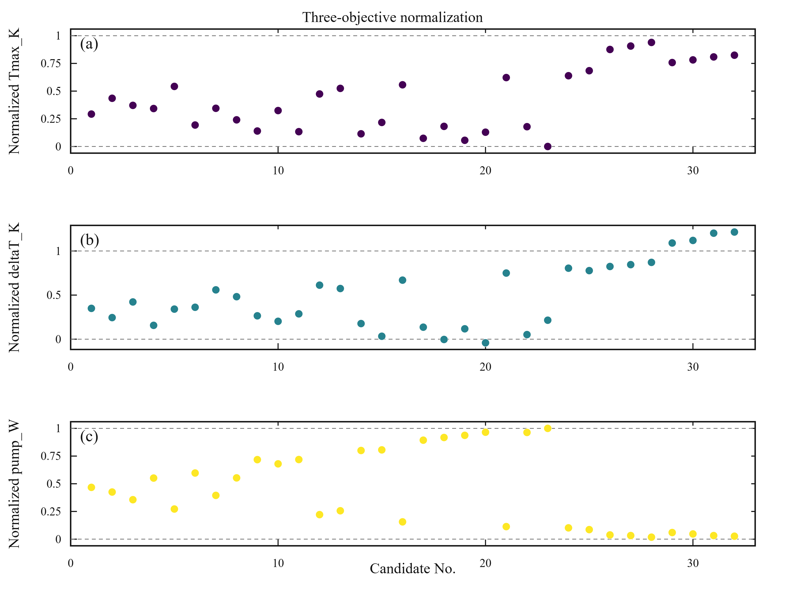
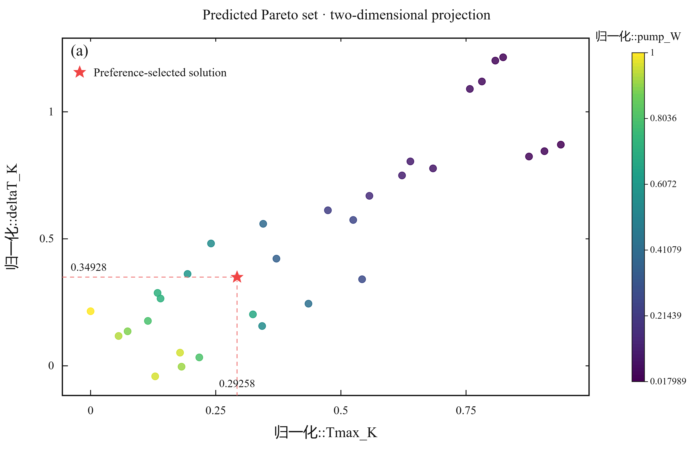
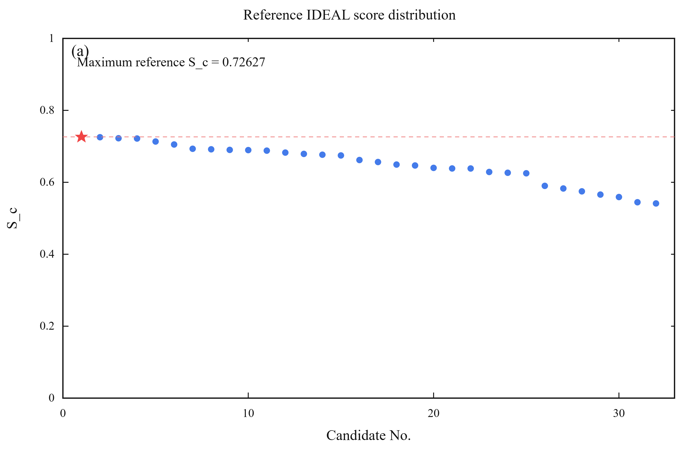
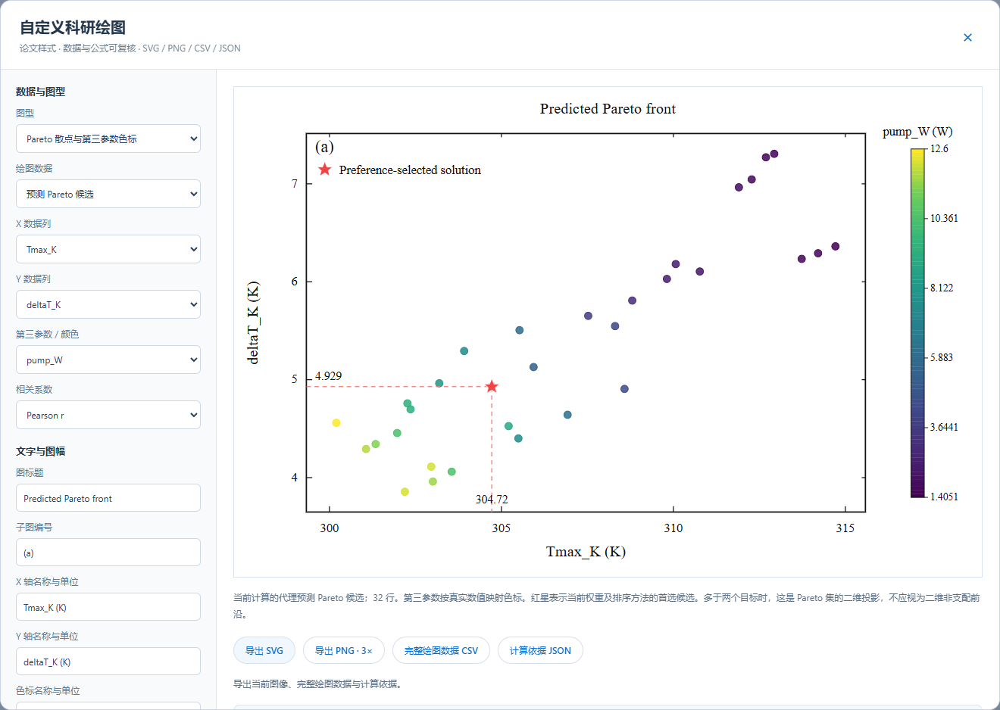
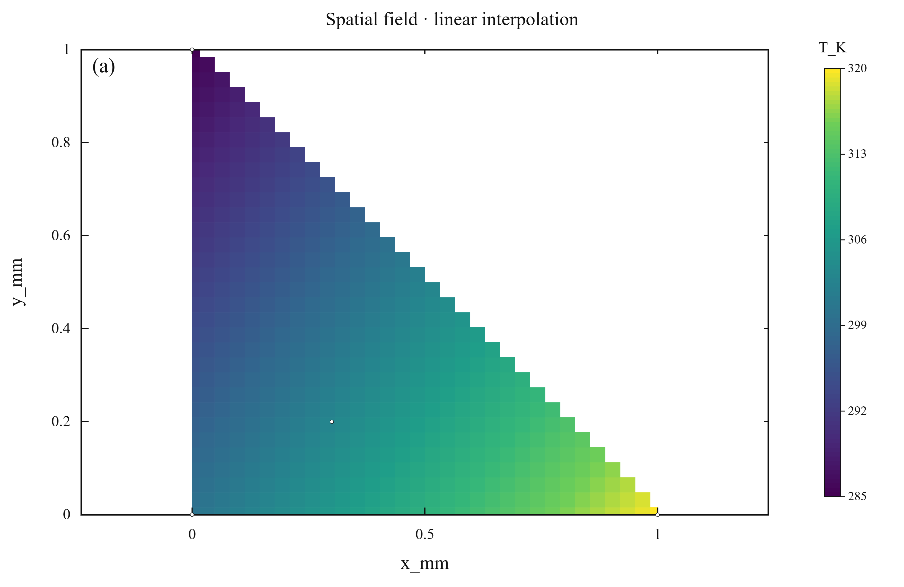

# 科研绘图与计算审计

**[打开研究工作台](https://Zhuayu16.github.io/research-multiobjective-optimizer/)** · 重庆理工大学 · 周华禹

本文说明图像使用的数值来源、种群/迭代定义、决策矩阵及温度插值方法。所有示例图来自公开合成函数或已知温度平面，不代表真实工程试验结果。

## 代理模型选择

可单独选择 **13 类模型**，或用 Auto 逐响应比较：线性回归、二次响应面、岭回归、弹性网络、三次正则响应面、距离加权 K 近邻、AdaBoost、高斯过程、RBF 支持向量回归、多层感知机、随机森林、极端随机树、梯度提升。

选型使用指定验证划分下的最小折外 NRMSE。模型选型与误差报告共用折，不能称为嵌套验证；指定的独立留出响应不参与拟合或选型。每个最终模型的参数、候选列表、实际拟合次数和验证耗时写入配置。Auto 比较固定模型配置，不执行无界超参数搜索。

新增模型的实现依据：[Ridge](https://scikit-learn.org/stable/modules/generated/sklearn.linear_model.Ridge.html)、[ElasticNet](https://scikit-learn.org/stable/modules/generated/sklearn.linear_model.ElasticNet.html)、[KNeighborsRegressor](https://scikit-learn.org/stable/modules/generated/sklearn.neighbors.KNeighborsRegressor.html)。三次响应面为三次多项式特征加岭正则；原始三次特征按训练折拟合与标准化。

## 种群、迭代与计算速度

- **种群规模 N**：一代中保留的候选设计数，每个个体是一组设计变量。
- **迭代代数 G**：每次独立搜索执行的进化代数。每代生成 N 个子代，与 N 个父代合并为 2N，再按约束支配、非支配等级和拥挤距离保留 N 个。
- **独立运行 R**：同一已拟合代理模型下用不同随机种子重复搜索。运行种子为 `seed + 7919 × run_index`。

当前实现执行固定 G 代，不用提前停止。每代分别预测 N 个父代和 2N 个合并个体，最后再预测 N 个，因此目标向量请求行数为 **R × N × (3G + 1)**，包含重复评估，不是独特设计数或 CFD 求解数。运行报告通过实际预测调用计数，逐代记录选择后种群的可行数、非支配数与冻结训练尺度 IDEAL 参考效用。辅助约束响应预测和验证预测不计入此搜索行数。

例：N=32、G=10、R=1 时，实际请求 992 行目标向量预测；3 个响应、5 折验证、每响应一个固定模型时，完成 3×(5+1)=18 次拟合。增加模型、验证折数、种群规模或代数会增加计算量。

计算通常比 CFD 快，原因是只拟合并评估已有数值表格的代理模型，不重建网格或求解流动/能量方程。合成案例含 50–60 个训练/验证样本，部分响应是低阶解析函数。网页刚打开的图是预先计算的合成预览；点击“运行优化”后才执行当前配置。首次依赖下载与后续环境复用分别记录；预处理、验证拟合、留出/约束、搜索和后处理有独立计时。此速度不能当作 CFD 加速比或物理准确性的证据。

## 决策矩阵与三参数归一化

每行是一个候选，原始矩阵为 `Y=[yᵢⱼ]`。优化开始前，从**训练数据**冻结每个目标的最小值 `aⱼ` 与最大值 `bⱼ`：

```text
uᵢⱼ = (yᵢⱼ − aⱼ) / (bⱼ − aⱼ)
最小化目标：δᵢⱼ = uᵢⱼ
最大化目标：δᵢⱼ = 1 − uᵢⱼ
有效损失：δ⁺ᵢⱼ = max(δᵢⱼ, 0)
wⱼ = 输入权重ⱼ / 所有输入权重之和
```

归一化图保留超出 0–1 的值；优于训练理想端点的改善在距离中作为零损失处理，不反向惩罚。三参数图展示前三个优化目标的归一化值，需要至少三个目标。它不把带单位的原始值直接相加。



选择“预测候选 · 含归一化与评分”作为绘图数据后，可将三个 `归一化::目标名` 分别指定为 X、Y 与颜色，直接绘制归一化的三参数 Pareto 投影。色标取归一化数值，不混用原始单位。



两种 IDEAL 距离定义分别可选，避免混用权重含义：

```text
IDEAL：             Dᵢ = sqrt(Σ wⱼ × (δ⁺ᵢⱼ)²)
IDEAL-COEFFICIENT： Dᵢ = sqrt(Σ (wⱼ × δ⁺ᵢⱼ)²)   ← 先乘权重再平方
S_c = 1 / (1 + Dᵢ)
```

附件形式对应 `IDEAL-COEFFICIENT`；软件沿用相对权重归一化与零改善损失规则，图像不会宣称直接复现附件的 0.799 等数值。当前排序若为 TOPSIS / ARAS，实际综合效用另列，`S_c` 仅作 IDEAL 参考评分。矩阵给出原始目标、归一化值、方向损失、有效损失、逐项加权平方、D、S_c 和综合效用复算差。Python 内核负责这些计算，浏览器绘图层读取数值；可用 CSV/JSON 独立复算。



## 自定义绘图窗口

完成一次计算后，点击结果区的 **科研绘图**。窗口支持：

- Pareto 散点与第三参数数值色标、三个目标归一化图、S_c 分布、归一化决策矩阵。
- 训练集 Pearson / Spearman 相关矩阵、逐代搜索记录。
- 单一工况位置数据的温度/场变量插值图。
- 数据源、坐标列、轴名/单位、标题、子图编号、字体、点大小、空心/实心、坐标与色标范围、Viridis/Turbo/Coolwarm、推荐点红星和虚线。
- SVG 矢量、3 倍图幅 PNG、完整绘图 CSV 和计算依据 JSON。



图像采用白底、黑色坐标框、内向刻度、衬线字体和数值色标。红星与投影虚线来自当前权重/决策方法的真实首选方案。输入样本图不标注虚构推荐点。三目标以上的 Pareto 集投影到二维时，可能存在投影支配，不能当作二维非支配前沿；仅两个目标、相应坐标且非输入样本时允许前沿连线。

SVG 内含实际坐标范围、色标范围、数据量和来源等元数据。JSON 包含完整绘图行、配置、模型参数、训练数据 SHA-256、计算审计、公式、软件/数值库版本和实际渲染元数据。坐标裁切与色标截断不会更改原始数据，并在元数据记录。PNG 是 SVG 的高分辨率栅格输出，字体来自本机；需统一期刊字体时优先使用可编辑 SVG。

## 相关矩阵是否真实

Pearson 与 Spearman 由 pandas/SciPy 从隔离独立留出的**训练行**计算；每对变量的有效样本数一并导出。常量列或有效配对样本不足时显示 NA，不填造相关系数。不报告显著性或因果关系，也不把高相关直接解释为变量的物理影响强度。

## 温度空间云图

先点击窗口中的“导入位置数据”，选择实际截面/平面的 X、Y、温度列，然后点击“计算空间插值”。数据须来自同一工况、时刻和截面，坐标使用相同长度单位。不同设计参数的案例表不能自动当作空间点。

使用 [SciPy griddata 的线性插值](https://docs.scipy.org/doc/scipy/reference/generated/scipy.interpolate.griddata.html)：Delaunay 三角剖分，每个三角形内按顶点场值的重心权重线性组合。采样凸包外掩膜，不外推；至少三个不共线位置点。同一位置不同场值会报告错误，要求先选择工况，不暗中取均值。图像按坐标等比例显示，并保留采样点。



验证数据为 `T_K=300+20*x_mm−15*y_mm` 的四个合成位置点；32×32 网格中 528 个位置有效、496 个位置掩膜，有效位置与解析值误差小于 10⁻⁸ K。这证明插值实现对该已知场的数值一致性，不代表真实流场、网格无关性或传热物理验证。

空间图有独立的位置数据 SHA-256、原始位置表、工作表/文件名、采样点、完整网格、掩膜数量、方法和库版本；不冒用优化训练数据的来源。此功能不自动求解 Fluent，也不从少量设计参数重建真实温度场。

## 验证记录

原有工作流与新增五类模型、两种距离公式、逐代计数、图像/矩阵导出和已知场插值都有真实浏览器或独立数值检查。查看 [浏览器报告](../validation/web/report.json)、[公开绘图与计算依据](../validation/web/)、[数值测试](../tests/test_scientific.py)及[浏览器集成检查](../tests/web_smoke.cjs)。
