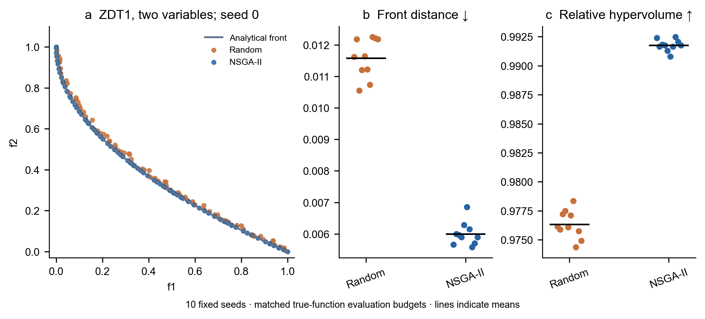
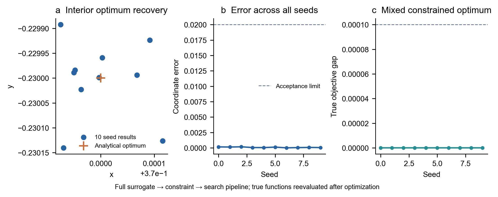
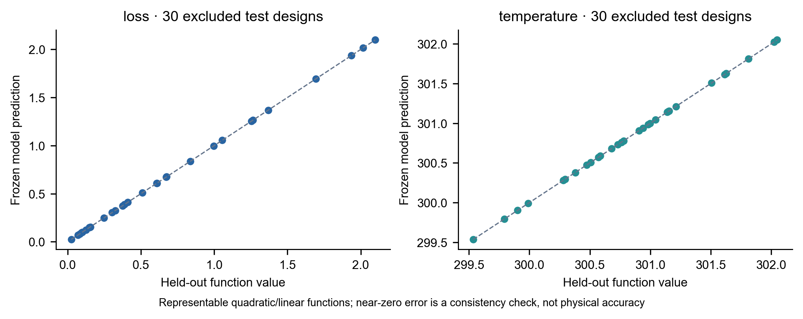
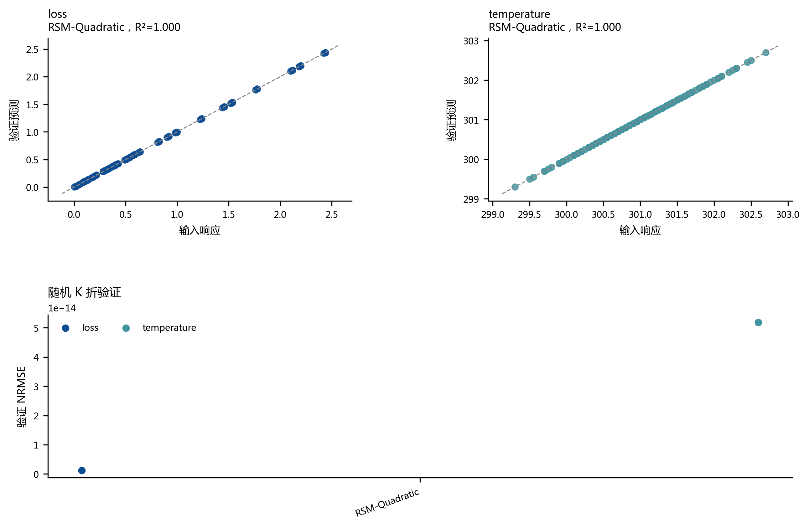
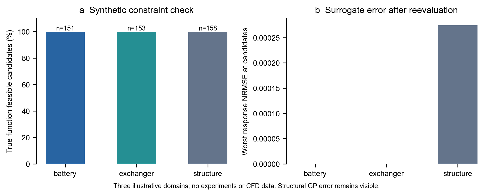
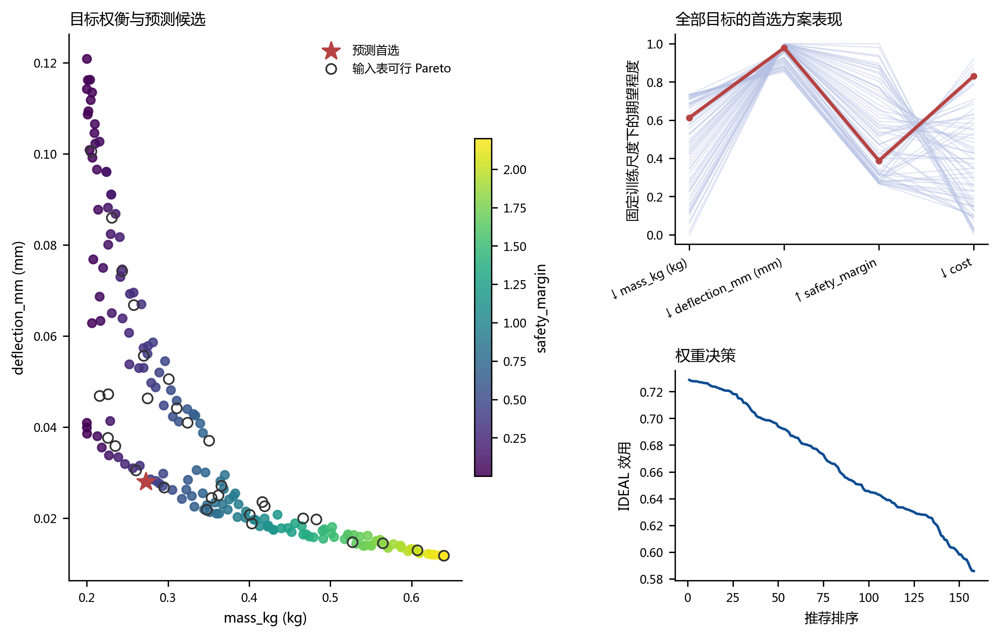

# 软件可行性与数值验证

[返回首页](../README.md) · [完整图集](gallery.md) · [逐次运行数据](../validation/results/benchmark_runs.csv) · [机器可读汇总](../validation/results/summary.json)

2026-10-05，v0.2.0。在 Windows / Python 3.13.5 环境完成 **30 次优化运行、10 次等预算随机基线、三个合成工程工作流及 13 项可行性检查**。另外实际打开 Qt 窗口，完成计算、项目恢复、留出验证与模型比较，记录 12 张流程截图。

这些检查验证软件的计算和交互链路。所有公开数据均为解析函数或合成数据，不能证明真实电池、换热器、结构或微燃烧器的物理预测准确性。原始研究数据不在本验证中。

## 1. 搜索结果是否接近已知 Pareto 前沿？

使用 **二维 ZDT1**，两变量均在 `[0,1]`：

$$f_1=x_1,\quad g=1+9x_2,\quad f_2=g(1-\sqrt{x_1/g}).$$

其解析前沿为 $f_2=1-\sqrt{f_1}$，且 $x_2=0$。定义依据 [pymoo 的问题定义示例](https://pymoo.org/problems/definition.html)。这里明确采用两变量版本，不能据此声称通过了通常的 30 变量 ZDT1 测试。

直接将真实函数接入软件现有 NSGA-II 内核，单独检查搜索算法；本项没有代理模型误差。种群 80、迭代 100、种子 0–9。记录每个种子的真实函数调用数 **24,080**，随机基线使用相同边界、种子和调用预算。两种方法各独立运行十次，逐次计算指标，不将十次结果合并后计分。



| 指标 | NSGA-II：均值 [最小值, 最大值] | 等预算随机搜索 | 预设验收阈值 |
| :--- | :--- | :--- | :--- |
| 参考前沿到候选集的平均最近欧氏距离 ↓ | 0.00600 [0.00558, 0.00685] | 0.01158 [0.01055, 0.01225] | 每次 ≤ 0.02 |
| 候选 HV / 参考前沿 HV ↑ | 0.99177 [0.99078, 0.99248] | 0.97633 [0.97436, 0.97836] | 每次 ≥ 0.95 |

距离取解析前沿上均匀采样的 2,001 个参考点，各自到候选集的最近欧氏距离后求算术平均；不对目标额外缩放。HV 使用最小化方向、参考点 `(1.1,1.1)`，以矩形并集面积独立计算。概念说明见 [pymoo 指标文档](https://pymoo.org/misc/indicators.html)。这里展示全部种子点和均值，未做显著性检验；随机搜索是基础参照，不能代表与先进算法的全面比较。

复核数据：[解析前沿](../validation/results/zdt1_reference.csv) · [候选坐标](../validation/results/zdt1_fronts.csv) · [逐次指标](../validation/results/benchmark_runs.csv)。

## 2. 完整代理模型工作流能否找回已知最优解？

以下两项从表格数据开始，实际调用 `run_general` 完成模型拟合、搜索和结果生成，各用种子 0–9 独立运行十次，种群 80、迭代 100。最终结果均用原始函数重新计算。

**连续变量解析问题。** 在 `[-1,1]²` 内最小化

$$L=(x-0.37)^2+2(y+0.23)^2.$$

训练数据为 6×6 网格，共 36 点；独立留出 20 个随机点。解析最优点 `(0.37,-0.23)` 不在训练网格中。使用二次响应面，十次最优坐标的欧氏误差均值 **8.36×10⁻⁵**，最大 **1.71×10⁻⁴**，低于预设 0.02。

**混合变量约束问题。** 连续变量 `x∈[-1,1]`、整数 `k∈{1,2,3,4}`、数值集合 `d∈{0.1,0.5,0.9}`：

$$L=(x-0.45)^2+0.08(k-2)^2+0.1(d-0.5)^2,$$
$$T=300+x+0.2k+d\ge301.5.$$

训练为 9×4×3 网格，共 108 点，独立留出 30 点。独立枚举 12 种离散组合，剔除一种在连续边界内无可行解的组合，再求其余 11 种的连续最优点，得到真值 `(0.45,2,0.9)`、`L=0.016`。十次最佳候选的真实目标差均小于 **3×10⁻⁹**，低于预设 10⁻⁴；候选的整数取值、集合取值及真实温度约束全部通过。





这里的函数可由二次/线性响应面准确表示，因此留出误差接近浮点精度。这是对拟合实现、留出隔离及搜索链路的检查，不是复杂物理模型的精度证明。

| 问题 | 数据 | 可直接打开的项目 | 复核候选 |
| :--- | :--- | :--- | :--- |
| 连续解析问题 | [CSV](../validation/results/quadratic_data.csv) | [.optproj](../validation/results/quadratic.optproj) | [候选](../validation/results/quadratic_candidates.csv) |
| 混合约束问题 | [CSV](../validation/results/mixed_data.csv) | [.optproj](../validation/results/mixed.optproj) | [候选](../validation/results/mixed_candidates.csv) · [独立枚举答案](../validation/results/mixed_reference.csv) |



## 3. 能否用于不同对象的表格优化？

运行仓库内三个领域的合成示例，各 60 个样本；种群 80、迭代 40、两次搜索、起始种子 42。候选导出后，使用示例的原始函数重新计算响应和约束，不能仅凭代理模型自己的判断宣布可行。

| 示例 | 返回候选数 | 原函数约束可行率 | 最差响应 NRMSE：候选预测对原函数 |
| :--- | ---: | ---: | ---: |
| 电池液冷 | 151 | 100% | 3.98×10⁻¹⁵ |
| 换热器 | 153 | 100% | 3.04×10⁻¹⁶ |
| 结构设计 | 158 | 100% | 2.74×10⁻⁴ |

电池和换热器合成函数与其二次模型相容；结构示例的高斯过程存在可见的非零预测误差。此处支持“同一软件可处理不同变量、目标方向和约束配置”，不能支持真实工程性能结论。





原始结果：[领域汇总](../validation/results/domain_runs.csv) · [电池候选](../validation/results/battery_candidates.csv) · [换热器候选](../validation/results/exchanger_candidates.csv) · [结构候选](../validation/results/structure_candidates.csv)。候选 CSV 保留原函数响应列，便于独立检查。

## 4. 数据隔离、恢复与实际界面是否可靠？

- **留出隔离：** 将留出集响应全部增加 10,000 后，预测候选及训练数据校验值保持一致，留出评估误差则增加。见 [隔离记录](../validation/results/holdout_isolation.csv)。
- **项目恢复：** 保存并重开 `.optproj`，检查原始表格和完整问题配置一致；再通过 Qt 界面重新计算。见 [可打开项目](../validation/results/workflow_battery.optproj)。
- **试验设计：** 30 个 Latin hypercube 点加 3 个中心重复点，检查整数与集合变量取值，并保留重复点。见 [DOE 表](../validation/results/mixed_DOE.csv)。
- **真实 Qt 工作流：** 打开窗口、执行后台计算，验证电池分组验证的 50 个训练样本和 10 个留出样本；另运行三响应两目标的辅助约束，以及 Auto 模型比较。截图通过实际窗口抓取生成。见 [界面检查记录](../validation/results/workflow_capture.json) 和 [完整图集](gallery.md)。
- **结果导出：** 生成两个解析问题和三个工程示例的五份 Excel 工作簿，保留配置、验证与候选结果，可在 [结果目录](../validation/results/) 下载。

## 5. 如何复现？

在仓库根目录执行：

```powershell
python -m pip install -r requirements.txt
python -m unittest discover -s tests -v
python scripts/validate_feasibility.py
python scripts/capture_workflow.py
```

验证脚本输出 `validation/results/` 与 `docs/assets/verification/`，失败时返回非零退出状态；截图脚本会打开实际窗口，需要可用的桌面会话。数值图同时保存 PNG、SVG 和 PDF，数据、种子、阈值、依赖版本与源码 SHA-256 保存在 [summary.json](../validation/results/summary.json)。

公开代码的回归测试为 **30 项通过、9 项需要私有研究数据的检查跳过**。上述 **13 项数值及工作流检查**另列在 [checks.csv](../validation/results/checks.csv)，不是回归测试数量的重复统计。

仓库另提供 [Windows 持续验证工作流](../.github/workflows/verification.yml)，运行状态以 [GitHub Actions](https://github.com/Zhuayu16/research-multiobjective-optimizer/actions/workflows/verification.yml) 实际记录为准。它在托管机器检查回归测试、解析基准、Qt 界面与独立目录安装包，保留运行产物 14 天。本地结果不能代替其运行结果。

## 6. 尚未建立的证据

目前尚无真实试验或 CFD 对代理候选的外部确认、跨操作系统验证、30 维 ZDT1 测试或与多种先进优化算法的系统比较。Auto 模型比较使用交叉验证，尚未实现嵌套验证。论文应按“可配置科研软件的实现与可复现验证”组织这些证据，并将工程案例标为合成示例。
