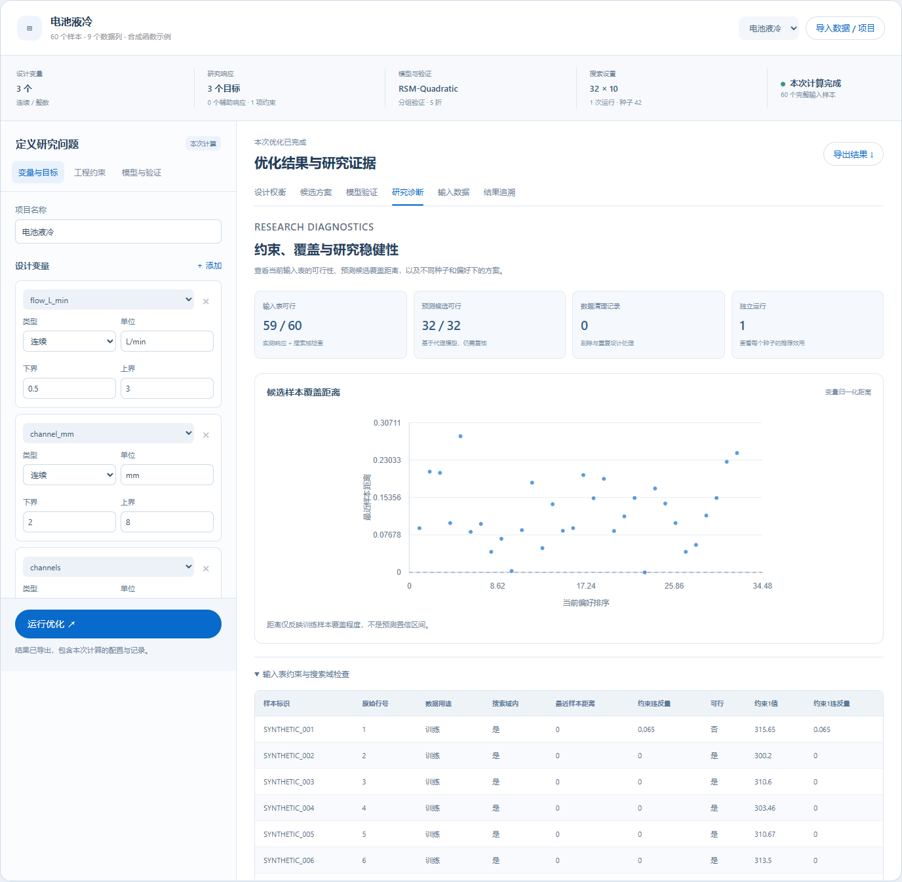
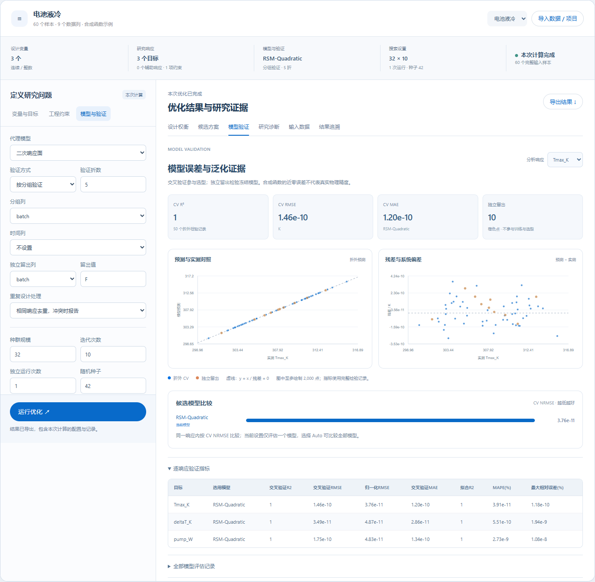
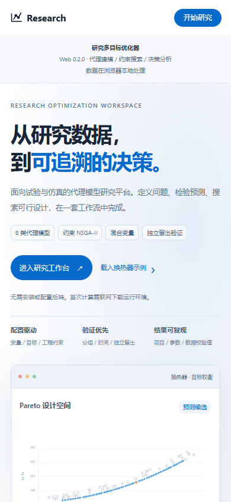

# 在线研究工作台

**[打开网站](https://Zhuayu16.github.io/research-multiobjective-optimizer/)** · [源码](../web/) · [真实浏览器验证脚本](../tests/web_smoke.cjs)

网页版重新设计了桌面软件的通用研究流程，采用大标题、留白、浅色卡片与蓝色操作按钮。GitHub Pages 仅提供静态文件，科学计算由浏览器的 Pyodide Web Worker 执行，无需自行维护后端服务器。


## 第一次使用

1. 点击“打开研究工作台”，选择电池液冷、换热器或结构设计。初始图表标明“合成示例预览”，尚不能导出为本次计算结果。
2. 检查变量类型、边界、目标方向和约束。也可导入 CSV、TSV、Excel、记录列表 JSON 或桌面软件的 `.optproj` 项目。Excel 多工作表可切换。
3. 点击“运行优化”。首次运行需要联网下载 Pyodide 和科学计算库，网络较慢时可能需要数分钟；依赖下载中断会重试。已有运行环境可复用。
4. 在“模型验证”检查交叉验证及独立留出误差，在“候选方案”区分代理模型预测与输入表 Pareto，在“结果追溯”检查参数、版本及训练数据散列。
5. 下载 CSV、14 个工作表的完整 Excel、当前 SVG 图、运行参数 JSON 或 `.optproj`。项目保存数据与问题配置，重新打开后运行计算；修改配置会立即使旧结果失效。

推荐使用桌面版 Chrome 或 Edge。手机可查看与操作，但大规模建模受设备内存和速度限制。关闭页面会终止计算并释放内存，请及时下载项目。取消按钮会结束计算线程，再次运行需重建计算环境。

## 功能与范围

### 研究分析界面

工作台顶部展示当前变量、目标、约束、模型、验证划分和搜索预算。界面数据随问题配置更新，计算完成后显示本次状态；修改任何计算配置会清除旧的分析结果。

- **设计权衡：**可切换坐标的 Pareto 图、当前偏好推荐，以及前八个预测候选的多目标平行坐标对比。相对表现使用冻结训练范围；超出 0–1 的改善保留，不被解释为置信度。
- **模型验证：**逐响应切换 CV 指标、预测与实测对照、残差图和候选模型比较。蓝色为折外 CV，橙色为独立留出；虚线分别表示 `y=x` 与零残差。图中最多绘制前 2,000 点，指标仍基于全部检验记录。
- **研究诊断：**输入表的实测可行性、预测候选的代理可行性、最近样本距离、数据清理记录、不同种子的独立运行比较，以及固定训练尺度的偏好敏感性。仅一次运行会明确说明不能据此评估跨种子稳定性。
- **方法与基准：**页面展示问题定义、验证划分、搜索与决策的流程和方法边界，并嵌入已公开的真实解析基准图，可跳转原始数据与自动验证记录。



| 功能 | 网页版 |
| :--- | :--- |
| 连续、整数、数值集合变量 | 支持；允许值须为数值 |
| 任意数量的最大化/最小化目标、相对权重 | 支持；辅助响应可仅用于约束 |
| 响应与变量表达式约束 | 与桌面版复用同一安全表达式解释器 |
| 八类代理模型与 Auto 比较 | 支持；树模型强制 `n_jobs=1` |
| 随机、分组、时间前向验证 | 支持；独立留出响应不参与训练或选型 |
| 边界框、凸包、最近样本距离限制 | 支持；仍受样本覆盖与代理误差限制 |
| NSGA-II、IDEAL/TOPSIS/ARAS 排序 | 复用原内核 |
| 数据、候选、验证、试验设计与项目导出 | 支持 |
| Fluent 自动求解、二进制 `.dat.h5`、MTPV/MTEG 专用耦合界面 | 使用原桌面工作流 |

单次浏览器计算上限：种群 240、迭代 300、独立运行 5 次；导入文件上限 20 MB、表格 50,000 行。这些是界面上限，不表示所有模型可在该规模下顺畅运行；高斯过程等模型应从较少样本开始。数据预览最多显示前 100 行，计算使用全部导入记录。

网页不把导入数据发送给远端计算接口，不自动保存到服务器或浏览器持久存储。首次加载会向静态托管方、Pyodide CDN 与 PyPI 请求代码和依赖，它们仍会收到正常网络访问信息。项目文件包含原始表格，请按自己的数据管理要求保管。

## 浏览器验证

2026-10-05，在 Windows 的 Chrome 154.0.8037.93 中以真实 WebAssembly Python 内核运行，未替换为模拟结果。参数为种群 32、10 代、1 次、固定种子；这组小规模设置检验流程，不是搜索性能基准。

| 检查 | 结果 |
| :--- | :--- |
| 电池液冷：整数变量、分组验证、独立留出 | 50 行训练、10 行留出、32 个预测候选；整数与温度约束通过，原函数复算误差 < 10⁻⁶ K |
| 换热器：离散间距、双向目标及压降约束 | 29 个候选；间距均为 2/4/6，压降原函数复算误差 < 10⁻⁶ Pa |
| 结构设计：四目标、高斯过程、响应约束 | 32 个候选；预测安全裕量满足配置约束，真实物理可行性未据此宣称 |
| `.optproj` 保存、恢复与重算 | 相同种子产生逐行相同候选 |
| 随机森林 | 在浏览器串行运行，无子进程依赖 |
| Auto、时间前向验证、辅助响应、凸包 | 八类模型参与比较；辅助响应参与建模和约束，不作为优化目标 |
| 不合理验证配置 | 清楚报告错误，旧结果不可导出，界面可继续操作 |
| CSV 与多工作表 Excel 导入 | 60 行 CSV 与 14 工作表结果文件读取通过，可选择工作表 |
| 结果与试验设计导出 | CSV、Excel、SVG、参数、项目均生成；试验设计含 30 点与 3 个中心重复点 |
| 配置失效、取消、响应式布局 | 旧结果失效，取消可用，390px 手机宽度无横向页面溢出 |
| 计算依赖下载中断 | 首次 SciPy 下载被测试主动中断，自动重试后无需刷新即可完成计算 |
| 新增科研分析视图 | 响应切换的 RMSE 与原指标表一致；50 个折外点和 10 个留出点分别进入对照与残差图；60 行约束诊断、10 行偏好比较和 8 条候选对比线均来自本次输出 |
| 独立运行与分析失效 | 两次真实种子运行显示两条记录；修改配置同时清除旧候选对比、残差及运行诊断 |
| 页面错误与数据网络传输 | 无未捕获页面错误；观察到的页面/线程请求仅 GET/HEAD |

完整 [机器报告](../validation/web/report.json)、[运行配置与候选](../validation/web/)、[测试脚本](../tests/web_smoke.cjs)可下载复查。每次推送会先在 GitHub Actions 的 Chromium 中实算检查，再发布静态网站。桌面版的解析前沿与多种子性能验证另见[数值验证](verification.md)，不要混同浏览器工作流检查与真实工程物理验证。



<p align="center"></p>

## 复现与部署

浏览器固定 Pyodide **0.29.3 / Python 3.13**，发行包内 NumPy 2.2.5、pandas 2.3.3、SciPy 1.14.1、scikit-learn 1.7.0，另加载 openpyxl 3.1.5 与 et-xmlfile 2.0.0。这些版本与桌面环境不同，实际运行版本写入导出配置的 `browser_runtime`。

`scripts/build_web.py` 只打包明确列出的 11 个科学计算模块、三个合成示例及公开预览候选，每个模块记录 SHA-256；不扫描整个研究目录，不打包 Qt 界面或私人研究数据。

```powershell
python -m pip install numpy pandas scipy scikit-learn threadpoolctl openpyxl xlrd
python scripts/build_web.py --output outputs/site
python -m http.server 8000 --directory web
```

本地检查用临时静态文件服务；发布后用户直接打开 GitHub Pages 地址，无需运行这些命令。复现浏览器检查：

```powershell
cd web
npm ci
npx playwright install chromium
npm test
```

网页部署文件明确列在构建脚本中，GitHub Actions 只上传 `outputs/site`，没有把完整仓库作为网站公开。自建副本可在仓库 Pages 设置中选择 **GitHub Actions**，随后由 [.github/workflows/pages.yml](../.github/workflows/pages.yml)验证并发布。

技术依据：[Pyodide Web Worker](https://pyodide.org/en/0.29.3/usage/webworker.html)、[GitHub Pages 静态托管](https://docs.github.com/en/pages/getting-started-with-github-pages/what-is-github-pages)。
